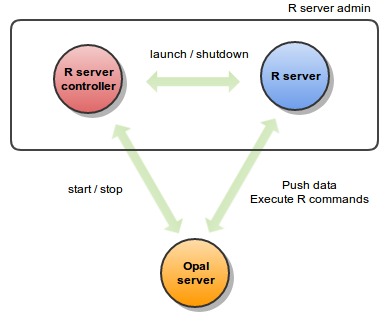

R Server
========

Installation
------------

Opal is able to interact with a R server for running statistics analysis and reports.

This guide is about how to install and configure an application called "R Server Admin". This application is made of a R server controller that does the following;

* listen to request for starting / stopping the R server,
* launch / shutdown the R server upon request.

Typical usage is the ability to start / stop a R server from the Opal R Server Administration User Interface. This decoupling of Opal and the R server allows to:

* run the R server on a different host,
* run the R server on behalf of a user having limited rights (in particularly, not having access to Opal server files).

Requirements
~~~~~~~~~~~~

Server Hardware Requirements
^^^^^^^^^^^^^^^^^^^^^^^^^^^^

============ ===============
Component    Requirement
============ ===============
CPU	         Recent server-grade or high-end consumer-grade processor
Disk space	 8GB or more (data are stored within the database, not in Opal server space).
Memory (RAM) Minimum: 4GB, Recommended: >8GB
============ ===============

Server Software Requirements
^^^^^^^^^^^^^^^^^^^^^^^^^^^^

`Java <https://www.java.com>`_ is the minimum software requirement, other software are for a fully functional system.

======== ================= ========================================================== ========================
Software Suggested version Download link                                              Usage
======== ================= ========================================================== ========================
Java     >= 1.8.x          `Java Oracle downloads <https://www.java.com>`_            Java runtime environment
R        >= 3.0.x          `R downloads <http://cran.r-project.org/>`_                Statistical analysis engine
======== ================= ========================================================== ========================

While Java is required by Opal server application, MongoDB/MySQL/R can be installed on another server.

Install
~~~~~~~

Opal is distributed as a Debian/RPM package and as a zip file. The resulting installation has default configuration that makes Opal ready to be used. Once installation is done, see :doc:`configuration` instructions.

Debian Package Installation
^^^^^^^^^^^^^^^^^^^^^^^^^^^

Opal R Server is available as a Debian package from OBiBa Debian repository. To proceed installation, do as follows:

* `Install Debian package <http://www.obiba.org/pages/pkg/>`_. Follow the instructions in the repository main page for installing Opal.
* Manage Opal Service: after package installation, Opal server is running: see how to manage the Service.

RPM Package Installation
^^^^^^^^^^^^^^^^^^^^^^^^

Opal R Server is available as a RPM package from OBiBa RPM repository. To proceed installation, do as follows:

* `Install RPM package <http://www.obiba.org/pages/rpm/>`_. Follow the instructions in the RPM repository main page for installing Opal.
* Manage Opal Service: after package installation, Opal is running: see how to manage the Service.

Zip Distribution Installation
^^^^^^^^^^^^^^^^^^^^^^^^^^^^^

Opal R Server is also available as a Zip file. To install Opal zip distribution, proceed as follows:

* `Download R Server Admin distribution <https://github.com/obiba/rserver-admin/releases>`_
* Unzip the R Server Admin distribution. Note that the zip file contains a root directory named **rserver-admin-x.y.z-dist** (where x, y and z are the major, minor and micro releases, respectively). You can copy it wherever you want. You can also rename it.
* Create a ``RSERVER_HOME`` environment variable
* Install `Rserve <https://cran.r-project.org/package=Rserve>`_, a R package that is library that enables the connection with R. This can be done within R by using the CRAN install command from the R console:

.. code-block:: r

  install.packages(c('rserve', 'opal', 'tidyverse', 'knitr', 'rmarkdown'), repos=c('http://cran.rstudio.com', 'http://cran.obiba.org'), dependencies=TRUE, lib='/usr/local/lib/R/site-library')

Upgrade
~~~~~~~

The upgrade procedures are handled by the application itself.

Debian Package Upgrade
^^^^^^^^^^^^^^^^^^^^^^

If you installed Opal via the Debian package, you may update it using the command:

.. code-block:: bash

  apt-get install opal-rserver

RPM Package Upgrade
^^^^^^^^^^^^^^^^^^^

If you installed Opal via the RPM package, you may update it using the command:

.. code-block:: bash

  yum install opal-rserver

Zip Distribution Upgrade
^^^^^^^^^^^^^^^^^^^^^^^^

Follow the Installation of Opal Zip distribution above but make sure you don't overwrite your opal-home directory.

Execution
~~~~~~~~~

Server launch
^^^^^^^^^^^^^

**Service**

When Opal is installed through a Debian/RPM package, Opal server can be managed as a service.

Options for the Java Virtual Machine can be modified if Opal service needs more memory. To do this, modify the value of the environment variable ``JAVA_ARGS`` in the file **/etc/default/opal**.

Main actions on Opal service are: ``start``, ``stop``, ``status``, ``restart``. For more information about available actions on Opal service, type:

.. code-block:: bash

  service rserver help

The Opal service log files are located in **/var/log/opal** directory.

**Manually**

The R Server Admin application can be launched from the command line.

==================== ======== ===========
Environment variable Required Description
==================== ======== ===========
``RSERVER_HOME``     yes      Path to the R Server "home" directory.
``JAVA_OPTS``        no       Options for the Java Virtual Machine. For example: `-Xmx4096m -XX:MaxPermSize=256m`
==================== ======== ===========

To change the defaults update:  ``bin/rserver`` or ``bin/rserver.bat``

Execute the command line (bin directory is in your execution PATH)):

.. code-block:: bash

  rserver

The R Server Admin server log files are located in **RSERVER_HOME/logs** directory. If the logs directory does not exist, it will be created by R Server.

Usage
^^^^^

R Server Admin is a REST server and therefore can be queried using the `curl <http://curl.haxx.se/>`_ tool.

.. code-block:: bash

  # R Server Admin requests

  # status of the R server
  curl localhost:6312/rserver

  # start R server (ignored if already started)
  curl -X PUT localhost:6312/rserver

  # stop R server (ignored if already stopped)
  curl -X DELETE localhost:6312/rserver

Troubleshooting
^^^^^^^^^^^^^^^

If you encounter an issue during the installation and you can't resolve it, please report it in our `Opal Issue Tracker <https://github.com/obiba/rserver-admin/issues>`_.

Opal logs can be found in **/var/log/opal**. If the installation fails, always refer to this log when reporting an error.

Rserve logs can be found in **/var/lib/rserver/logs/Rserve.log** and might indicate R errors.

In case the **Rserve** R binary package does not match the R version, it is possible to update it from the R console (started as root), with the following command:

.. code-block:: text

  install.packages("Rserve", "http://www.rforge.net/", type="source", lib="/usr/lib/R/site-library")

Configuration
-------------

R Server Admin package has two configuration files: one for the R server controller and one for the R serv itself.

Controller Configuration
~~~~~~~~~~~~~~~~~~~~~~~~

The file **RSERVER_HOME/conf/application.properties** allows the configuration of the R server controller. This one provides REST web services to start/stop a R server.

=============== ===================
Property        Description
=============== ===================
``server.port``	R server controller port (default is 6312).
``r.exec``	    R executable path, required to launch the R server.
=============== ===================

Rserve Configuration
~~~~~~~~~~~~~~~~~~~~

The file **RSERVER_HOME/conf/Rserv.conf** allows the configuration of the core R server. See also `the full documentation of the Rserv.conf file <http://www.rforge.net/Rserve/doc.html#conf>`_.

By default the R server has the following configuration:

* connection port is 6311,
* remote connection is disabled,
* no authentication is required.

If the R server is installed on a different machine as the Opal server, you typically will have to:

* enable remote connection,
* enable authentication.

R Session Configuration
~~~~~~~~~~~~~~~~~~~~~~~

When a new R session is started on server side the starting state of this session can be configured using the **RSERVER_HOME/conf/Rprofile.R**. Any R command (to be executed by the ``rserver`` user) can be put in this file.
