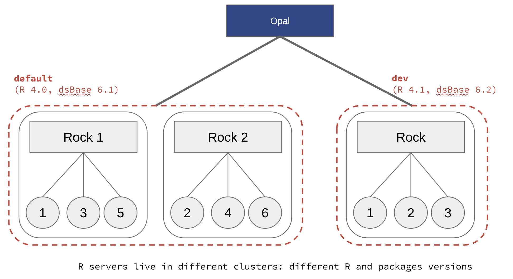

.. _rserver:

R Server
========

Opal delegates many of its computation and data source connection capabilities to the attached R server(s).

See the `Rock R server documentation <https://rockdoc.obiba.org>`_ to install and configure one or more instances of R server that Opal will use to balance the computation load.

Read also the :ref:`apps` documentation to know how to interconnect Opal with some R servers.

R Server Scalability
--------------------

Opal can interact with several R servers, grouped in a cluster. All R servers from a cluster are expected to be the same (version of R, R packages installed), i.e. Opal can create new R sessions in one or another. This allows **load balancing** between R servers, especially useful in a multi-user environment when computation intensive R operations are done (omics analysis for instance).

.. figure:: ../images/opal-rock-scalability.png
  :scale: 50 %
  :alt: Rock horizontal scalability

  Add more Rock servers and balance the load to scale R services horizontally.

R Server Profiles
-----------------

Opal supports multiple clusters of R servers, each one is designated by a **profile** name. This allows to have different flavors of R servers living aside of each others: different versions of R, different R packages installed, in different versions. Such configuration is easy to setup when `deploying Rock with Docker <https://rockdoc.obiba.org/en/latest/admin/installation.html#docker-image-installation>`_. As the footprint of a Rock server is small, using a containerized deployment it is possible to have several versions of R servers running on the same host.

  Add more Rock server flavors and allow R users to select the appropriate one.

DataSHIELD Profiles
-------------------

Based on Opal's capability to handle different profiles (clusters) of R servers, it is also possible to define several `DataSHIELD <https://datashield.org>`_ profiles. A DataSHIELD profile is a R server profile combined with a DataSHIELD configuration (allowed functions, options and permissions). DataSHIELD users can then decide in which environment their analysis are to be performed, for a better reproducible science. DataSHIELD administrators can also fine tune the DataSHIELD configurations for advanced usages. Such configuration is easy to setup when `deploying Rock with Docker <https://rockdoc.obiba.org/en/latest/admin/installation.html#docker-image-installation>`_, eliminating the burden of dealing with several versions of R and packages, and of installing potentially hundreds of R packages.

.. figure:: ../images/opal-datashield-profiles.png
  :scale: 50 %
  :alt: DataSHIELD profiles

  Define different DataSHIELD configurations using profiles.
