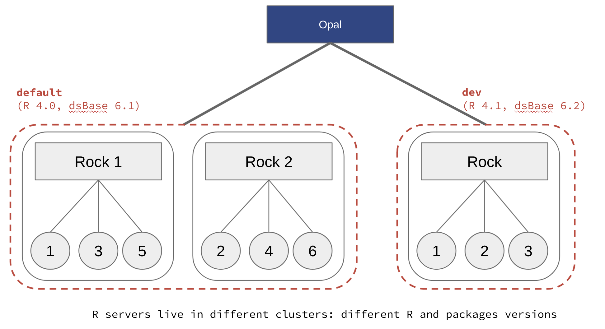

.. _cb-r:

How to Set up R Server Profiles
===============================

Opal is able to connect to multiple R servers: see :ref:`rserver` documentation. The benefits of having multiple R servers are:

* Having different versions of R and/or R packages (i.e. profiles) installed, for reproducible science (see also :ref:`cb-renv`),
* Balance the computation load other several R servers with same profile.

Opal has two different strategies for establishing connection with R servers (see :ref:`apps` documentation):

* Self-registration, which is flexible and then appropriate for load balancing,
* Service discovery, which is preferred for managing multiple R server profiles.

Whatever the chosen registration strategy, the name of the R profile in Opal is the name of the ``cluster`` declared in the Rock R server configuration (see `Cluster Node Configuration <https://rockdoc.obiba.org/en/latest/admin/configuration.html#cluster-node-configuration>`_ documentation).

Using the `Docker <https://www.docker.com/>`_ technology, several R servers can run on the same host. An R server packaged in a Docker container is also easier to maintain, when R packages are to be updated or when a computation environment is to be restored. Therefore, the following instructions will recommend the Docker usage and more specifically the `Docker Compose <https://docs.docker.com/compose/>`_ tool.

.. _prepare-docker-images:

Step 1 - Prepare Docker Images
------------------------------

The following Rock R server Docker images are proposed:

.. list-table::
  :widths: 300 10000
  :header-rows: 1

  * - Image
    - Description
  * - `obiba/rock <https://hub.docker.com/r/obiba/rock>`_
    - | `Rock R server <https://www.obiba.org/pages/products/rock/>`_ application with R and useful R packages and system libraries.
      | Everything you need for a standard R server connected to Opal (reporting, resources, analysis).
      | Available tags are:
      | - ``latest``, ``<rock_version>`` (for instance ``1.0``)
      | - ``<rock_version>-R<r-version>`` (for instance ``1.0-R4.1``).
  * - `datashield/rock-base <https://hub.docker.com/r/datashield/rock-base>`_
    - | Based on ``obiba/rock`` image and includes the `dsBase <http://datashield.github.io/dsBase/>`_ R package for basic DataSHIELD analysis.
      | This is the recommended base image for the DataSHIELD users.
      | Available tags are:
      | - ``latest``, ``<dsBase_version>`` (for instance ``6.1``)
      | - ``<dsbase_version>-R<r_version>`` (for instance ``6.1-R4.1``).
      | As a reference, see `datashield/rock-base Dockerfile <https://github.com/datashield/docker-rock/blob/main/base/Dockerfile>`_.
  * - `datashield/rock-mediation <https://hub.docker.com/r/datashield/rock-mediation>`_
    - | Based on ``datashield/rock-base`` image and includes the `dsMediation <https://github.com/datashield/dsMediation>`_ R package for mediation related DataSHIELD analysis.
      | Available tags are:
      | - ``latest``, ``<dsMediation_version>`` (for instance ``0.0.1``).
      | As a reference, see `datashield/rock-mediation Dockerfile <https://github.com/datashield/docker-rock/blob/main/mediation/Dockerfile>`_.
  * - `datashield/rock-omics <https://hub.docker.com/r/datashield/rock-omics>`_
    - | Based on ``datashield/rock-base`` image and includes the `dsOmics <https://github.com/isglobal-brge/dsOmics>`_ R package for omics related DataSHIELD analysis.
      | Available tags are:
      | - ``latest``, ``<dsOmics_version>`` (for instance ``1.0`` or ``1.0.7``).
      | As a reference, see `datashield/rock-omics Dockerfile <https://github.com/obiba/docker-rock-omics/blob/master/Dockerfile>`_.
  * - `datashield/rock-exposome <https://hub.docker.com/r/datashield/rock-exposome>`_
    - | Based on ``datashield/rock-base`` image and includes the `dsExposome <https://github.com/isglobal-brge/dsExposome>`_ R package for exposome related DataSHIELD analysis.
      | Available tags are:
      | - ``latest``, ``<dsExposome_version>`` (for instance ``1.0`` or ``1.0.1``).
      | As a reference, see `datashield/rock-exposome Dockerfile <https://github.com/obiba/docker-rock-exposome/blob/master/Dockerfile>`_.

From these base images, it is possible to make your own, with additional R packages and system libraries installed. See for instance these demo images:

* `obiba/rock-demo:geo Dockerfile <https://github.com/obiba/docker-rock-demo/blob/geo/Dockerfile>`_ installs geo system libraries and a DataSHIELD R package for geolocalized data analysis.
* `obiba/rock-demo:survival Dockerfile <https://github.com/obiba/docker-rock-demo/blob/survival/Dockerfile>`_ installs the `dsSurvival <https://github.com/neelsoumya/dsSurvival>`_ DataSHIELD package.

Step 2 - Docker Compose Configuration
-------------------------------------

Your Docker Compose configuration can include the Opal server but it is not mandatory, as the Opal server can be installed from a native package, whereas the multiple R servers will be started from docker images.

Different ``datashield/rock-base`` images can be used to expose different R packages versions. The DataSHIELD researcher can specify the appropriate profile name at connection time to ensure that the analysis envrionment is reproducible.

In the following example, several R servers will be accessible through their own port number, and the Opal server must be configured accordingly.

.. code-block:: yaml

  version: '3'
  services:
      datashield:
          image: datashield/rock-base:latest
          ports:
              - ${PORT_DEFAULT}:8085
          environment:
              - ROCK_ID=${ROCK_ID}
              - ROCK_CLUSTER=default
      datashield-61:
          image: datashield/rock-base:6.1-R4.1
          ports:
              - ${PORT_BASE61}:8085
          environment:
              - ROCK_ID=${ROCK_ID}-base-6.1
              - ROCK_CLUSTER=base-6.1

.. warning::

  Make sure there is always an R servers cluster name called ``default``, which is the default profile name expected by Opal when none is specified.

Step 3 - Discover Rock R Servers in Opal
----------------------------------------

To configure Rock apps discovery in Opal, you can:

* Either set the ``apps.discovery.rock.hosts`` property in the **opal-config.properties** file, see :ref:`appsconf` documentation. Opal server restart is then required.
* Or declare dynamically the new apps in the **Administration > Apps** page, *Discovery* section, see :ref:`apps-discovery` documentation. No Opal server restart is necessary.

You can then verify in the **Administration > R** page that several R servers are connected to, organized by cluster/profile. Each Rock R server reports host information (CPU cores, free memory) and the number of active R sessions.

Step 4 - Use R Profiles from R Client
-------------------------------------

In an R console, install the `opalr R package <https://www.obiba.org/opalr/>`_. See also the :ref:`r` documentation.

The following script will list the R profiles on the `opal-demo <https://opal-demo.obiba.org>`_ server:

.. code-block:: r

  # load opal library
  library(opalr)
  # connect to the opal server
  o <- opal.login(username = "administrator", password = 'password', url = 'https://opal-demo.obiba.org')

  # list R profiles
  opal.profiles(o)

  # disconnect
  opal.logout(o)

When an R operation requires to assign data and perform calculations in an R server, the R server profile can be specified at login time: a remote R session will be created in an R server from the named cluster.

.. code-block:: r

  # load opal library
  library(opalr)
  # connect to the opal server with profile 'geo'
  o <- opal.login(username = "administrator", password = 'password', url = 'https://opal-demo.obiba.org', profile = "geo")

  # verify that 'dsGeo' is installed in this profile
  oadmin.package_description(o, "dsGeo")

  # assign some GPS data, stored in a file resource and compute summary
  opal.assign.resource(o, "res", "RSRC.gps_data")
  opal.assign.script(o, "gps", quote(as.data.frame(res)))
  opal.execute(o, "summary(gps)")

  # disconnect
  opal.logout(o)

Step 5 - Troubleshooting
------------------------

If anything goes wrong in an R server, check the output of the R commands in the R server logs.

.. note::

  1. Go to the **Administration > R** page,
  2. Select the R server profile/cluster,
  3. Download the R server logs.

This log may contain information, when for instance an R package is broken or some R function calls output some error/warning messages without failing properly.
