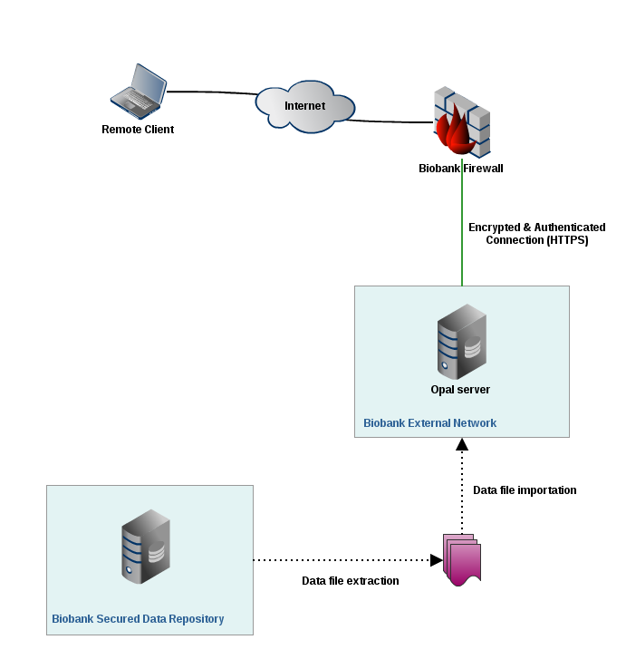
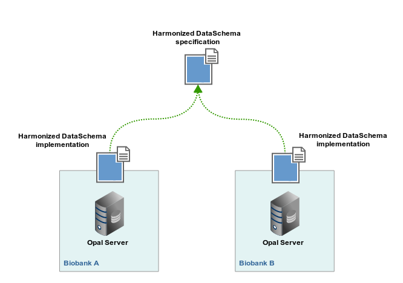
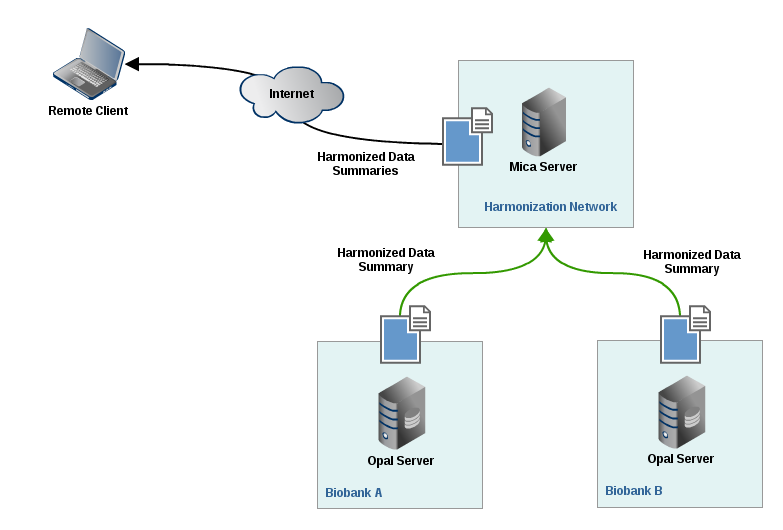

Data Harmonization
==================

Opal Application
----------------

Opal includes a comprehensive software infrastructure facilitating data harmonization as well as seamless and secure data-sharing amongst Biobanks.

Data Harmonization with Opal
~~~~~~~~~~~~~~~~~~~~~~~~~~~~

To achieve effective data harmonization and querying of harmonized datasets between Biobanks, the steps are:

* Set up Opal servers for each Biobanks and import relevant data sets,
* Configure a harmonized description of data in each Opal server,
* Set up a Mica server that is able to authenticate itself against each Opal server,
* Run distributed queries on harmonized data sets.

Results and Benefits
~~~~~~~~~~~~~~~~~~~~

When several Biobanks set up a network of Opals with the aim of harmonizing data, the benefits are:

* Individual-level data are hosted by the Biobank they belongs to,
* Each Biobank controls access rights to data in Opal.
* Consistent data access across Opal servers.

Collaborative research projects are highly facilitated when harmonizing data using Opal. Opal provides:

* Formal descriptions of harmonized data,
* Real-time availability of Harmonized dataset summaries from each Biobank,
* Real-time distributed statistical analysis through DataSHIELD method.

Opal is strongly integrated with Mica, a generic web portal for Biobank consortia. Through the Mica web interface, authenticated researchers can perform distributed queries on the content of each individual Biobank data collection hosted by Opal. Moreover, Opal implements the DataSHIELD method which enables individual-level data analysis across multiple Opal instances.

Data Harmonization Infrastructure
---------------------------------

Opal in Study Networks
~~~~~~~~~~~~~~~~~~~~~~

Opal is an application that runs on a server. Opal can be accessed through a secured connection (encrypted and authenticated). One possible network architecture to integrate Opal in Biobank infrastructure is the following:

* The Biobank Secured Database Repository is where the Biobank data is stored. Ideally it is not connected to any network and therefore data are imported in Opal using files.
* The Biobank External Network is a private network that hosts the Opal application and a database (running on the same server or on two different servers).

Opal ensures data access security through a variety of mechanisms:

* The Opal server is hosted in a network that is protected by a firewall which only allows connections using encrypted (HTTPS) protocol through a specific port. Connections can also be restricted to specific remote clients.
* Opal application itself requires user authentication. Data hosted by Opal are subject to authorization (authenticated users can only see authorized data).
* Data are extracted from Biobank database as CSV files. These files are then imported in Opal database through the Opal application. There is no direct link between Opal and the Biobank Data Repository.

Data Harmonization across Studies
~~~~~~~~~~~~~~~~~~~~~~~~~~~~~~~~~

The aim of the data harmonization process is to transform study-specific data into a common format defined in the DataSchema and to access data in each Biobanks:

* The Biobanks have to agree on a Harmonized DataSchema, i.e. the description of the common data format,
* Each Biobank imports relevant datasets onto their dedicated Opal server,
* The Harmonized Data schema is uploaded in each Opal servers,
* Processing algorithms are then developed to derive study-specific variables into DataSchema format variables.

Study Consortium Web Portal
~~~~~~~~~~~~~~~~~~~~~~~~~~~

Mica is a web portal which aims at disseminating summary data from consortium members once it has been harmonized. A Mica server will connect and authenticate itself against each of the Biobanks Opal servers holding the harmonized datasets. In return Mica server will display in its web interface data summaries of harmonized variables (count, min/max, mean, stdv etc.) to the remote user.

Note that when accessing harmonized data summaries:

* The remote client never connects directly to any Opal server (Mica act as a broker),
* Individual-level data are never extracted from Opal servers (data aggregations are computed in Opal).

Distributed analyses with DataSHIELD
~~~~~~~~~~~~~~~~~~~~~~~~~~~~~~~~~~~~

DataSHIELD stands for `Data Aggregation Through Anonymous Summary-statistics from Harmonized Individual-levEL Databases <https://www.obiba.org/pages/products/datashield/>`_.

Some research projects demand very large sample size for detecting interactions. Such projects usually require pooling individual-level data from several studies to obtain this sample size. Important ethico-legal constraints often prevent or impede the pooling of individual level data.

DataSHIELD is a method by which an analysis of individual-level data from several sources can be done without actually pooling the data from these sources together. The process is described in a `paper published in IJE <https://academic.oup.com/ije/article/39/5/1372/804410>`_. Through Mica web interface, distributed DataSHIELD queries can be run on any harmonized data sets hosted on Opal.
