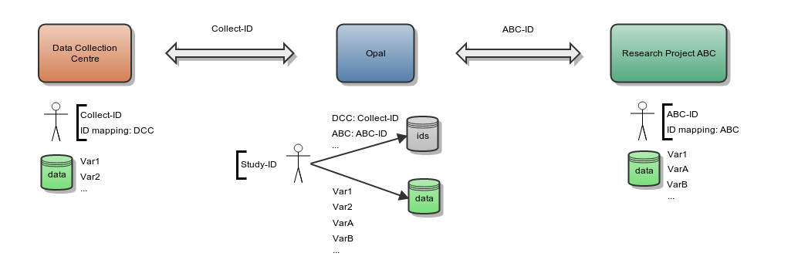

.. _ids:

Identifiers Mappings
====================

Following the OBiBa paradigm of separation of concerns, the concept of "Identifiers Mappings" defines how to protect participant's privacy while exchanging data with Opal. The exchanges can be in both directions: imports and exports. Participants privacy is ensured by not communicating private participant identifier (use of a shared key instead).

Participant Identifier Separation
---------------------------------

The following diagram shows the different identifiers that can be assigned to one participant.

Opal separates the participant identifiers from the participant's data in two databases:

* the Opal identifier database will store the participant identifiers,
* the Opal data database will store anonymous participant's data.

One participant is identified in these two databases by a unique identifier which is the system identifier (usually the study identifier). Opal is able to find a participant from a given shared identifier.

Data Importation
~~~~~~~~~~~~~~~~

The importation process is the following for one participant:

* if an identifiers mapping is provided, different importation strategies can apply:

  * each imported identifier must be mapped to a system identifier, otherwise the importation will fail,
  * each imported identifier must be mapped to a system identifier, otherwise the importation will ignore these data,
  * or when an imported identifier cannot be mapped to a system identifier, create a unique system identifier and map it to the imported one,

* else, no identifiers mappings is specified and therefore imported identifiers are considered to be system identifiers.

Data Exportation
~~~~~~~~~~~~~~~~

The same identifiers mapping process can apply when exporting data. To avoid collusion between research projects requesting for data, each of them will be delivered data with participant's identifiers specific to them. This way "Research Project ABC" will not be able to put in common its Study data with "Research Project 123". It will only be possible if the Study allows it.

Integration with Onyx
---------------------

`Onyx <https://www.obiba.org/pages/products/onyx/>`_ is the OBiBa's solution for collecting participants data. Data exported by Onyx can be directly imported in Opal. If participant is assigned a different identifier in each data collection sites, then it will be required to define in Opal a identifiers mapping for each of these sites.
