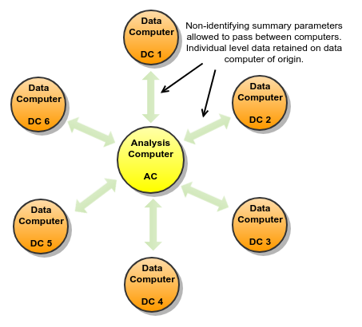
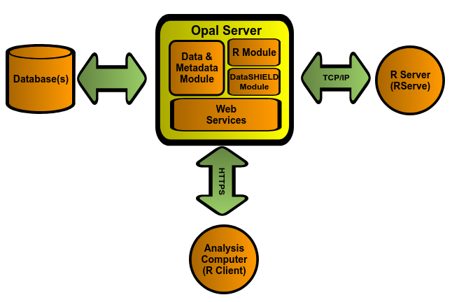

R DataSHIELD Introduction
=========================

What is R?
----------

R is a freely available language and environment for statistical computing and graphics which provides a wide variety of statistical and graphical techniques: linear and nonlinear modelling, statistical tests, time series analysis, classification, clustering, etc.

Please consult the `R project <http://www.r-project.org/>`_ for further information.

What is DataSHIELD?
-------------------

DataSHIELD (`Wolfson et al., 2010 <http://ije.oxfordjournals.org/content/39/5/1372.abstract>`_) is a novel method that enables a pooled data analysis to be carried out across several collaborating studies as if one had full access to all of the data from individual participants that might be needed, but, in reality, these data remain completely secure on their host computer at the home base of the study where they were collected or generated. DataSHIELD therefore permits a fully efficient pooled analysis to be undertaken of biomedical data from several studies, even when ethico-legal or other governance restrictions prohibit the release of individual-level data to third parties.

The following figure illustrates the basic IT infrastructure that underpins DataSHIELD; it reflects a hypothetical implementation based on a pooled analysis involving data from six studies. The individual-level data that provide the basis of the analysis remain on ’data computers’ (DCs) at their home bases. An additional computer is identified as the ‘analysis computer’ (AC). This is the computer on which the primary statistician will type the commands to enact and control the pooled analysis.

Please consult the `DataSHIELD project <http://datashield.org/>`_ for further information.

R and DataSHIELD implementation in Opal
---------------------------------------

Opal uses the `R <http://www.r-project.org/>`_ statistical environment to implement DataSHIELD. The implementation is made of 3 components:

* an Opal server
* an R server (using Rserve)
* an R package for Opal (installed on the Analysis Computer)

Opal Server Component
~~~~~~~~~~~~~~~~~~~~~

This component has several sub components necessary to implement DataSHIELD:

* a data and metadata module
* an R module
* a DataSHIELD module

These sub components are accessible through web services (HTTPs) and interact with each other to provide an extensible and customisable DataSHIELD implementation.

Data and metadata module
~~~~~~~~~~~~~~~~~~~~~~~~

Used for obtaining the data necessary for the actual analysis within DataSHIELD. The module also provides metadata that is used for describing the variables involved during the analysis. This metadata provides at least the type of variable (categorical, continuous, logical, etc.), but can also provide higher-level information such as labels, descriptions, etc.

R module
~~~~~~~~
Used for the interaction between an R statistical environment and Opal. Specifically, this module allows pushing data from Opal into an R environment and back. It can also execute arbitrary R code within these environments.

Opal interacts with an R server through `Rserve <https://cran.r-project.org/package=Rserve>`_'s protocol. This allows the R Server to be on a different machine than the Opal server. It also allows maintaining R separately from Opal.

DataSHIELD module
~~~~~~~~~~~~~~~~~

Built "on top" of the R module, this provides a constrained and customisable access to the R environment. Specifically, this module allows pushing data from Opal into R, but does not allow reading this data unless it has first been "aggregated".

The term "aggregated" here means that the data in R must go through a method that will summarize individual-level data into another form that removes the original individual-level data. For example, obtaining the length of a vector, obtaining the summary statistics of a vector (min, max, mean, etc.)

It is these methods that are customisable. That is, administrators of the Opal server can add, remove, modify and create completely custom "aggregating" methods that are provided to DataSHIELD clients.

Web Services
~~~~~~~~~~~~

Interaction between these modules and their clients is done through Web Services.

R Server Component
~~~~~~~~~~~~~~~~~~

R is made accessible to Opal through the Rserve library. This allows running R commands from several remote clients. Doing so allows running R and Opal on different machines if necessary.

Note that this R Server will eventually contain individual-level data (it will be pushed there by the Opal server). This R server should be secured just like other machines involved in handling individual-level data. This data is not made directly available to Opal clients.

R Clients (Analysis Computers)
~~~~~~~~~~~~~~~~~~~~~~~~~~~~~~

The interaction between the analysis computer and Opal is done through another R environment running on the AC. To support these interactions, Opal provides an R package that can be installed using normal R functionalities (CRAN).

Clients can then use this package to authenticate to Opal instances and interact with the DataSHIELD methods offered by these servers.
