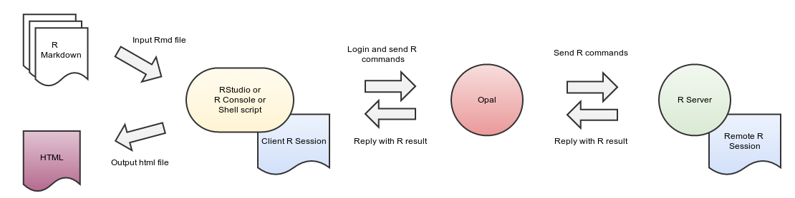
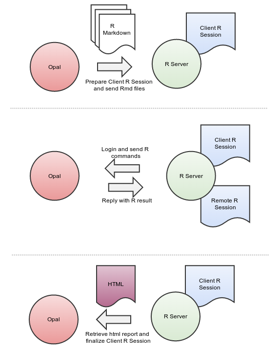

Reporting with R
================

This guide provides information about how to design reports with R over Opal data.

R being a programming language, any text editor could be used. In this guide we recommend to use the `RStudio editor <https://www.rstudio.com/products/rstudio/>`_ as `it has reporting features integrated <https://rmarkdown.rstudio.com/authoring_quick_tour.html>`_. RStudio is cross-platform, free of charge (Open Source Edition) and is available as a Desktop or a Server application. The Server flavor is more suitable for teams (shared development environment) and when restrictive security constraints apply (IP white-listing).

Prerequisites
-------------

In order to be able to interact with a Opal server, the prerequisites are the following:

* having R installed both on client and on server sides
* having R package *opal* installed
* having access to a Opal server

Design of a Report Tutorial
---------------------------

A report in Opal is essentially a R script enhanced with presentation directives. This reporting capability is brought by the `knitr <http://yihui.name/knitr/>`_ R package. As the report IS a R script, it can be executed in different contexts:

* R console
* RStudio editor
* Shell script
* Opal

See more information about Report Execution Flows.

The following steps will walk you through the design of a report, tested in a development environment (R console/RStudio), then deployed in a production environment (Shell script/Opal).

First Step: Write a R Script
~~~~~~~~~~~~~~~~~~~~~~~~~~~~

Report data are coming first, so start with writing a R script that:

* connects to a Opal server
* assign some Opal data to the remote R session
* analyze, transform the data from the remote R session
* end remote R session

**Example**

See an example of such a script: `opal.R <https://github.com/datashield/opal/blob/master/inst/reports/tutorial/opal.R>`_.

Run it in a R console or RStudio.

Second Step: Turn R script to R markdown
~~~~~~~~~~~~~~~~~~~~~~~~~~~~~~~~~~~~~~~~

The R script can be enhanced with presentation directives as specified by `knitr <http://yihui.name/knitr/>`_. We will chose the specific R report format based on Markdown. Detailed documentation can be found in the R Markdown article.

**Example**

See an example of such a report: `opal-dev.Rmd <https://github.com/datashield/opal/blob/master/inst/reports/tutorial/opal-dev.Rmd>`_.

You can run it in RStudio as described in the `Using R Markdown <https://rmarkdown.rstudio.com/articles_intro.html>`_ article.

See the `Opal Reporting with R output <http://rstudio-pubs-static.s3.amazonaws.com/9706_d98063be1a1a423bab93955921f43b58.html>`_.

Third Step: Prepare for Deployment
~~~~~~~~~~~~~~~~~~~~~~~~~~~~~~~~~~

As you might have noticed the `opal-dev.Rmd <https://github.com/datashield/opal/blob/master/inst/reports/tutorial/opal-dev.Rmd>`_ contains the credentials of the user connecting to the Opal server. These can be externalized. Credentials will be provided by the context of execution as R options:

* Shell script
* Opal

See documentation about `opal.login <https://cran.obiba.org/web/opal/opal.login.html>`_ function for available R options.

**Example**

See an example of a production report `opal-prod.Rmd <https://github.com/datashield/opal/blob/master/inst/reports/tutorial/opal-prod.Rmd>`_. Note that no user credentials is provided. RStudio cannot execute it as usual as the editor does not knit the report in the current R session.

To execute this report you can use the `opal.report <https://cran.datashield.org/web/opal/opal.report.html>`_ helper function that will knit it for you. See an example of a R shell script running it: `opal-exec.R <https://github.com/datashield/opal/blob/master/inst/reports/tutorial/opal-exec.R>`_.

For executing it in Opal, see instructions on how to specify the R options in the Reports Administration documentation.

Final Step: Schedule Report Execution
~~~~~~~~~~~~~~~~~~~~~~~~~~~~~~~~~~~~~

Once a report design is done, it is possible to register it in Opal in order to:

* publish it so that it can be executed manually by other users,
* execute it periodically,
* archive and publish the reports generated.

For more details see Reports Administration.

If you have written a shell script, such as `opal-exec.R <https://github.com/datashield/opal/blob/master/inst/reports/tutorial/opal-exec.R>`_ example, it can be executed as any `cron <https://en.wikipedia.org/wiki/Cron>`_ task.

Advanced Examples
-----------------

See advanced examples in the `table <https://github.com/datashield/opal/tree/master/inst/reports/table>`_ folder, where `opal-table.Rmd <https://github.com/datashield/opal/tree/master/inst/reports/table>`_ features:

* R Markdown sub-reports,
* inline css-styling,
* access to Opal variables description.

The result of this report is a document that presents the data dictionary of a Opal table with figures and summary statistics.

See `Opal Data Dictionary with R output <http://rstudio-pubs-static.s3.amazonaws.com/12023_275f05c12c5b4ee8b6114660be19b628.html>`_.

Report Execution Flows
----------------------

Local R Session
~~~~~~~~~~~~~~~

When executed in the context of RStudio, R console or Shell script, the communication flow is:

Opal R Session
~~~~~~~~~~~~~~

When executed by Opal the communication flow is:

