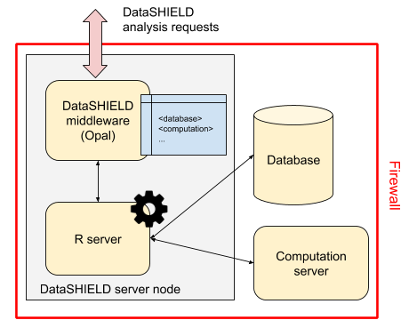

Resources
=========

Developing and implementing new algorithms to perform advanced data analyses in `R <https://www.r-project.org/>`_ or under the `DataSHIELD <http://datashield.ac.uk>`_ framework is a current active line of research. However, the analysis of big data within R/DataSHIELD has some limitations. Some of them are related to how data is managed in the Opal's database and others are related to how to perform statistical analyses of big data within the R environment. Opal databases are for general purpose and do not properly manage large amounts of information and, second, it requires moving data from original repositories into Opal which is inefficient (this is a time, CPU and memory consuming operation) and is difficult to maintain when data are updated. We have overcome the problem related to R/DataSHIELD big data management by developing a new data infrastructure within Opal: **the resources**.

Concept
-------

Resources are datasets or computation units which location is described by a URL and access is protected by credentials. When assigned to a R/DataSHIELD server session, remote big/complex datasets or high performance computers are made accessible to data analysts.

**Instead of storing the data in Opal's database, only the way to access them is to be defined**: the datasets are kept in their original format and location (a SQL database, a SPSS file, R object, etc.) and are read directly from the R/DataSHIELD server-side session. Then as soon as there is a R reader for the dataset or a connector for the analysis services, a resource can be defined. Opal takes care of the permissions (a DataSHIELD user cannot see the resource's credentials) and of the resources assignment to a R/DataSHIELD session.

Note that Opal does not require the usage of a database backend (such as MySQL/MariaDB or MongoDB) to manage the resources: this simplifies a lot the deployment of Opal (memory footprint is also drastically reduced) as data access is delegated to the R server.

Types
-----

The data format refers to the intrinsic structure of the data. A very common family of data formats is the `tabular format <https://en.wikipedia.org/wiki/Table_(information)>`_ which is made of rows (entities, records, observations etc.) and columns (variables, fields, vectors etc.). Examples of tabular formats are the `delimiter-separated values formats <https://en.wikipedia.org/wiki/Delimiter-separated_values>`_ (CSV, TSV etc.), the `spreadsheet <https://en.wikipedia.org/wiki/Spreadsheet>`_ data formats (Microsoft Excel, LibreOffice Calc, Google Sheets etc.), some proprietary statistical software data formats (SPSS, SAS, Stata etc.), the `database tables <https://en.wikipedia.org/wiki/Table_(database)>`_ that can be stored in structured database management systems that are row-oriented (MySQL, MariaDB, PostgreSQL, Oracle, SQLite etc.) or column-oriented (Apache Cassandra, Apache Parquet, MariaDB ColumnStore, BigTable etc.), or in semi-structured database management systems such as the documented-oriented databases (MongoDB, Redis, CouchDB, Elasticsearch etc.).

When the data model is getting complex (data types and objects relationships), a domain-specific data format is sometimes designed to handle this complexity so that statistical analysis and data retrieval can be executed as efficiently as possible. Examples of domain-specific data formats are encountered in the omic or geospatial fields of research. A data format can also include some additional features such as data compression, encoding or encryption. Each data format requires an appropriate reader software library or application to extract the information or perform data aggregation or filtering operations.

We have prepared a test environment, with the Opal implementation of the resources and an appropriate R/DataSHIELD configuration that is available at: `opal-demo.obiba.org <https://opal-demo.obiba.org>`_, more specifically in the `RSRC project <https://opal-demo.obiba.org/ui/index.html#!project;name=RSRC>`_ (use administrator/password to login). As it can be seen this example project, the data storage can simply be a file to be accessed directly from the host's file system or to be downloaded from a remote location. More advanced data storage systems are software applications that expose an interface to query, extract or analyze the data. These applications can make use of a standard programming interface (e.g. SQL) or expose specific web services (e.g. based on the HTTP communication protocol) or provide a software library (in different programming languages) to access the data. These different ways of accessing the data are not exclusive from each other. In some cases the micro-data cannot be extracted, only computation services that return aggregated data are provided. The data storage system can also apply security rules, requiring authentication and proper authorizations to access or analyze the data.

Definition
----------

We call *resource* this data or computation access description. A resource will have the following properties:

* the **location** of the data or of the computation services,
* the **data format** (if this information cannot be inferred from the location property),
* the **access credentials** (if some apply).

The resource location description will make use of the web standard described in the `RFC 3986 <https://tools.ietf.org/html/rfc3986>`_ "Uniform Resource Identifier (URI): Generic Syntax". More specifically, the Uniform Resource Locator (URL) specification is what we need for defining the location of the data or computation resource: the term Uniform allows to describe the resource the same way, independently of its type, location and usage context; the term Resource does not limit the scope of what might be a resource, e.g. a document, a service, a collection of resources, or even abstract concepts (operations, relationships, etc.); the term Locator both identifies the resource and provides a means of locating it by describing its access mechanism (e.g. the network location). The URL syntax is composed of several parts:

* a *scheme*, that describes how to access the resource, e.g. the communication protocols "https" (secured HTTP communication), "ssh" (secured shell, for issuing commands on a remote server), or "s3" (for accessing Amazon Web Service S3 file store services),
* an *authority* (optional), e.g. a server name address,
* a *path* that identifies/locates the resource in a hierarchical way and that can be altered by query parameters.

The resource's data format might be inferred from the path part of the URL, by using the file name suffix for instance. Nevertheless, sometimes it is not possible to identify the data format because the path could make sense only for the data storage system, for example when a file store designates a document using an obfuscated string identifier or when a text-based data format is compressed as a zip archive. The format property can provide this information.

Despite the authority part of the URL can contain some user information (such as the username and password), it is discouraged to use this capability for security considerations. The resource's credentials property will be used instead, and will be composed of an identifier sub-property and a secret sub-property, which can be used for authenticating with a username/password, or an access token, or any other credentials encoded string. The advantage of separating the credentials property from the resource location property is that a user with limited permissions could have access to the resource's location information while the credentials are kept secret.

Once a resource has been formally defined, it should be possible to build programmatically a connection object that will make use of the described data or computation services. This resource description is not bound to a specific programmatic language (the URL property is a web standard, other properties are simple strings) and does not enforce the use of a specific software application for building, storing and interpreting a resource object.

resourcer R Package
-------------------

The `resourcer <https://github.com/obiba/resourcer>`_ package is an R implementation of the data and computation resources description and connection. It is reusing many existing R packages for reading various data formats and connecting to external data storage or computation servers. The resourcer package role is to interpret a resource description object to build the appropriate resource connection object. Because the bestiary of resources is very wide, the resourcer package provides a framework for dynamically extending the interpretation capabilities to new types of resources.

Opal uses the `Resource Forms <https://github.com/obiba/resourcer#resource-forms>`_ API to dynamically discover new type of resources installed in the R server and build for each of them a user-friendly interface to capture the domain specific resource details.
