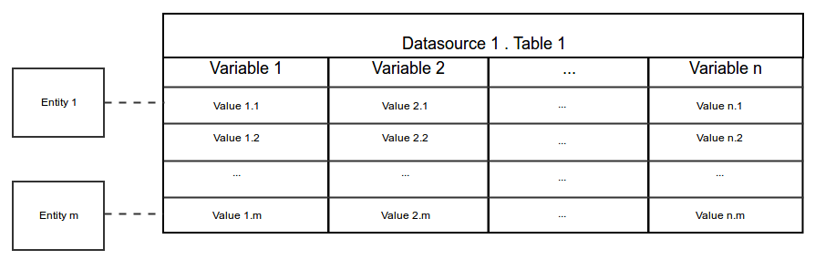
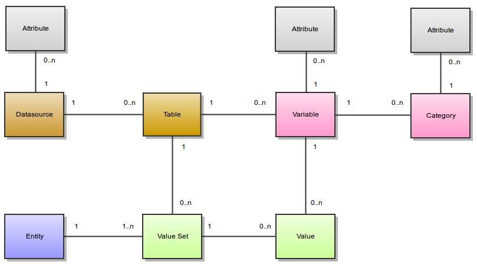

Variables and Data
==================

The variables are organized in an abstract way, independently of the way they are persisted.

The following diagram presents a 'traditional' view of what is a table:

* the 'columns' are the variables,
* the 'rows' are the value sets for each entity,
* the 'cells' are the variable entity values.

The following diagram shows the relationships between the different concepts:

Variables
---------

Variables and Categories
~~~~~~~~~~~~~~~~~~~~~~~~

A variable describes a set of values. The values of a variable are all of the same type. Possible value types are:

* integer
* decimal
* text
* binary
* locale
* boolean
* datetime
* date
* point
* linestring
* polygon

A variable is about an entity, i.e. all the values for a variable are from the same entity type. Possible entity types are:

* Participant
* Instrument
* ...

A category describe some of the possible values of a variable. A category is associated to one and only one variable.

Datasources and Tables
~~~~~~~~~~~~~~~~~~~~~~

A variable is in one and only one table.

A table has several variables and is in one and only one datasource.

A datasource has several tables. A datasource is not a database: it can be persisted in a database, using different schema. It can also be persisted in a file in xml or Excel formats. It is important to understand that Opal separates the formal description of the variables from the way they are persisted. This gives to Opal a lot of versatility.

Attributes
~~~~~~~~~~

Datasources, variables and categories have attributes. These attributes provide additional meta-information. An attribute is made of:

* a namespace (optional),
* a name (required),
* a locale (optional), that specifies in which language is the attribute value,
* a value (required even if null).

Example of a variable *asked_age* which has the following attributes:

============= ====== ==============
Name          Locale Value
============= ====== ==============
label         en     What is your age ?
label         fr     Quel est votre age ?
questionnaire        IdentificationQuestionnaire
page                 P1
============= ====== ==============

The variable *asked_age* has also some categories (with their attributes):

+------+------------------------------------+
| Name | Attributes                         |
+======+====================================+
| 888  | | label:en=Don't know              |
|      | | label:fr=Ne sait pas             |
+------+------------------------------------+
| 999  | | label:en=Prefer not to answer    |
|      | | label:en=Préfère ne pas répondre |
+------+------------------------------------+

Fully Qualified Names
~~~~~~~~~~~~~~~~~~~~~

Each of these elements has a short name. A fully qualified name will identify them uniquely:

* Datasource fully qualified name: <datasource_name>
* Table fully qualified name: <datasource_name>.<table_name>
* Variable fully qualified name: <datasource_name>.<table_name>:<variable_name>

The fully qualified name is useful for disambiguation.

Following the example of the *asked_age* variable, its fully qualified name could be: *opal-data.IdentificationQuestionnaire:asked_age*

Derived Variables
~~~~~~~~~~~~~~~~~

A derived variable is a variable which values are computed using a script. This script is expressed using the Magma Javascript API.

Views
~~~~~

Opal deals with variables and values in tables. Views are here to:

* define a subset of a table, both in terms of variables and values,
* define a subset of many tables in terms of variables and values,
* define #Derived Variables that are to be resolved against 'real' ones.

These virtual tables are then manipulated just like standard tables (for instance they can be copied to a datasource).

Given table **Table1**:

.. list-table::
   :widths: 25 25 25 25
   :header-rows: 1

   * - ID
     - Var1
     - Var2
     - Var3
   * - 1
     - Value 1.1
     - Value 2.1
     - Value 3.1
   * - 2
     - Value 1.2
     - Value 2.2
     - Value 3.2
   * - 3
     - Value 1.3
     - Value 2.3
     - Value 3.3

A view can be defined so that the resulting 'table' may be **View1**:

.. list-table::
   :widths: 20 40 40
   :header-rows: 1

   * - ID
     - Var1
     - Var3
   * - 1
     - Value 1.1
     - Value 3.1
   * - 3
     - Value 1.3
     - Value 3.3

or **View2**:

.. list-table::
   :widths: 20 80
   :header-rows: 1

   * - ID
     - DerivedVar = function(Var1, Var2)
   * - 1
     - function(Value1.1, Value2.1)
   * - 3
     - function(Value1.3, Value2.3)

Given Table1 above and the following table **Table2**:

.. list-table::
   :widths: 25 25 25 25
   :header-rows: 1

   * - ID
     - VarA
     - VarB
     - VarC
   * - 100
     - Value A.100
     - Value B.100
     - Value C.100
   * - 200
     - Value A.200
     - Value B.200
     - Value C.200
   * - 300
     - Value A.300
     - Value B.300
     - Value C.300

A view can also be a combination or a 'join' of both tables, as in **View3**:

.. list-table::
   :widths: 20 20 20 20 20
   :header-rows: 1

   * - ID
     - Var1
     - Var3
     - VarA
     - VarC
   * - 1
     - Value 1.1
     - Value 3.1
     -
     -
   * - 3
     - Value 1.3
     - Value 3.3
     -
     -
   * - 100
     -
     -
     - Value A.100
     - Value C.100
   * - 300
     -
     -
     - Value A.300
     - Value C.300

Data
----

Entities
~~~~~~~~

The entities can be of different types:

* Participant (most common)
* Instrument (provided by Onyx)
* Workstation (provided by Onyx)
* ... (any that might fit your needs)

Each entity has a unique identifier. An entity can have several value sets, but only one value set for a particular table.

Value Types
~~~~~~~~~~~

The following table gives more information about the textual representation of a value, given a value type:

.. list-table::
   :widths: 10 90
   :header-rows: 1

   * - Value Type
     - Value as a String
   * - integer
     - The string value must all be decimal digits, except that the first character may be an ASCII minus sign '-' to indicate a negative value. The resulting integer has radix 10 and the supported range is [-2 :sup:`63`, 2 :sup:`63`-1].
   * - decimal
     - As described by `Java Double documentation <https://docs.oracle.com/javase/8/docs/api/java/lang/Double.html#valueOf-java.lang.String->`_.
   * - text
     - As-is.
   * - binary
     - `Base64 <http://en.wikipedia.org/wiki/Base64>`_ encoded.
   * - locale
     - | String representation of a locale is <language>[_<country>[_<variant>]] (for instance en, en_CA etc.) where:
       |
       | language: lowercase two-letter ISO-639 code.
       | country: uppercase two-letter ISO-3166 code.
       | variant: vendor specific code, see `Java Locale <https://docs.oracle.com/javase/8/docs/api/java/util/Locale.html>`_.
   * - boolean
     - True value if is equal, ignoring case, to the string "true".
   * - datetime
     - | Date times are represented in `ISO_8601 <http://en.wikipedia.org/wiki/ISO_8601>`_ format: "yyyy-MM-dd'T'HH:mm:ss.SSSZ"
       | Supported input formats are (four digits year is required):
       |
       | yyyy-MM-dd'T'HH:mm:ss.SSSZ
       | yyyy-MM-dd'T'HH:mm:ssZ
       | yyyy-MM-dd'T'HH:mmZ
       | yyyy-MM-dd'T'HH:mm:ss.SSSzzz
       | yyyy-MM-dd HH:mm:ss
       | yyyy/MM/dd HH:mm:ss
       | yyyy.MM.dd HH:mm:ss
       | yyyy MM dd HH:mm:ss
       | yyyy-MM-dd HH:mm
       | yyyy/MM/dd HH:mm
       | yyyy.MM.dd HH:mm
       | yyyy MM dd HH:mm
   * - date
     - | Dates are represented in `ISO_8601 <http://en.wikipedia.org/wiki/ISO_8601>`_ format: "yyyy-MM-dd"
       | Supported input formats are (four digits year is required):
       |
       | yyyy-MM-dd
       | yyyy/MM/dd
       | yyyy.MM.dd
       | yyyy MM dd
       | dd-MM-yyyy
       | dd/MM/yyyy
       | dd.MM.yyyy
       | dd MM yyyy
   * - point
     - | Point coordinates (longitude, latitude).
       | Supported input formats are:
       |
       | GeoJSON
       | JSON
       | Google Map
       |
       | # GeoJSON
       | {type: "Point", coordinates: [-71.34, 41.12]}
       |
       | # GeoJSON coordinates only: [lon,lat]
       | [-71.34, 41.12]
       |
       | # JSON (different flavours of keys)
       | {"lat" : 41.12,"lon" : -71.34}
       | {"lat" : 41.12,"lng" : -71.34}
       | {"latitude" : 41.12,"longitude" : -71.34}
       | {"lt" : 41.12,"lg" : -71.34}
       |
       | # String, comma separated latitude and longitude (Google map like): lat,lon
       | 41.12,-71.34
   * - linestring
     - | Array of point coordinates.
       | Supported input format is GeoJSON:
       |
       | # GeoJSON
       | {type: "LineString", coordinates: [[22.2,44.1],[33.4,55.3],[32.12,44]]}
       |
       | # GeoJSON coordinates only
       | [[22.2,44.1],[33.4,55.3],[32.12,44]]
   * - polygon
     - | Array of shapes. A shape is a list of points. The last point must be equal to the first point.
       | Supported input format is GeoJSON:
       |
       | # GeoJSON
       | {type: "Polygon", coordinates: [[ [100.0, 0.0], [101.0, 0.0], [101.0, 1.0], [100.0, 1.0], [100.0, 0.0] ]]}
       |
       | # GeoJSON coordinates only: one shape polygon
       | [
       |  [ [100.0, 0.0], [101.0, 0.0], [101.0, 1.0], [100.0, 1.0], [100.0, 0.0] ]
       | ]
       |
       | # GeoJSON coordinates only: polygon with outter and inner shapes
       | [
       |  [ [100.0, 0.0], [101.0, 0.0], [101.0, 1.0], [100.0, 1.0], [100.0, 0.0] ],
       |  [ [100.2, 0.2], [100.8, 0.2], [100.8, 0.8], [100.2, 0.8], [100.2, 0.2] ]
       | ]

Value Sets and Values
~~~~~~~~~~~~~~~~~~~~~

A value is associated to a variable and is part of a value set. Each value set is for a particular entity and a particular table. An entity has a maximum of one value set in one table.

A value is always associated with a type and a data (or a sequence of data if the variable is ``repeatable``).
