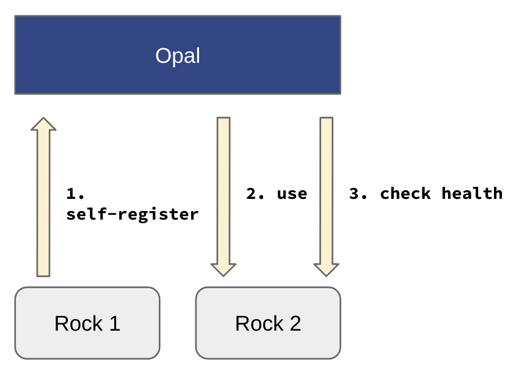
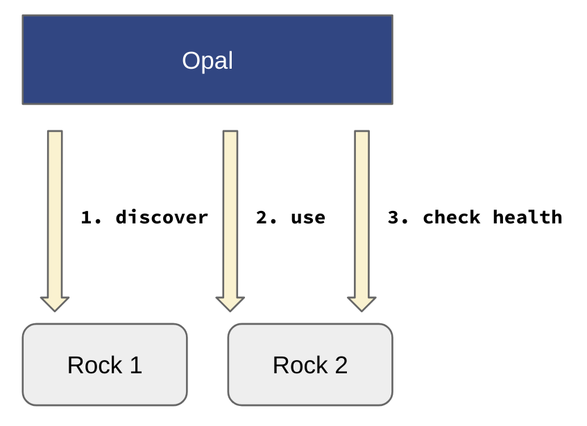

.. _apps:

Apps
====

An application is an external service that can be used by the system. Applications can be discovered from their URL or can register themselves using the application authentication token.

Registry
--------

The registered apps can be unregistered. Note that an app that was discovered, will be automatically registered again. To remove it completely it is necessary to remove it from the apps discovery configuration and then unregister it.

Configuration
-------------

For now, the only type of app known and supported is the `Rock R server <https://rockdoc.obiba.org>`_.

Self-registration
~~~~~~~~~~~~~~~~~

To register itself, an application must provide a registration token in its request. See :ref:`appsconf` to set a default value for this token. Then periodical checks are performed: if the application cannot be reached or reports to be dysfunctional, it is automatically unregistered. With the self-registration mechanism it is easy to add more computation power to Opal without changing the configuration.

  Rock server self-registration.

Discovery
~~~~~~~~~

Applications can be discovered at runtime. When discovered, the application is automatically registered. Then periodical checks are performed: if the application cannot be reached or reports to be dysfunctional, it is automatically unregistered. See :ref:`appsconf` for setting the discovery interval and the default hosts to lookup. With the discovery mechanism it is easy to set up some default external services.

  Rock server discovery.
