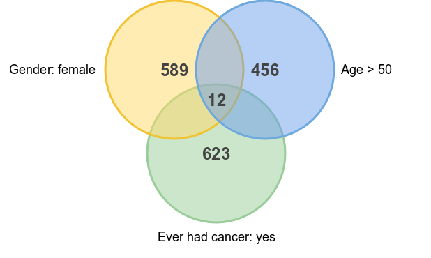

Search Entities
===============

Entities can be searched by defining variable criteria. The result of this search gives the count of entities for each of the criterion and the count of entities satisfying all the criteria. The variables can be from different tables, meaning that the resulting count is the intersection of each entity sub-query.

Prerequisite
------------

Only tables which values have been indexed can be searched.

Variable Criteria
-----------------

A variable criterion, is a variable which will be used to discriminate the entities satisfying some constraints on its values. Several variable criteria are combined with AND conjunction: the results must satisfy each criterion.

Add Criterion
~~~~~~~~~~~~~

**Lookup and Add**

The variable of interest can be found by typing keywords such as ``alco wine -weekend`` will propose variables containing alco AND wine in their name/label AND NOT containing weekend.

**Add from Cart**

The cart can be populated with variables that where searched (see Search Variables) or that were added when exploring the table (selection from the variable list of the table page, or individual selection from the variable page).

Use Criterion
~~~~~~~~~~~~~

Each variable criterion can be used to filter the entities:

========= ===========
Operation	Description
========= ===========
All       The values of the variable can be any value (empty or not empty).
Empty     The values of the variable are empty (null value or value sequence with all null values).
Not empty The values of the variable are not empty (not null value or value sequence with at least one not null value).
In        The value of the variable has some specified value(s).
Not in    The value of the variable has not some specified value(s).
========= ===========

Identifier Criterion
--------------------

It is also possible to filter the entities by their identifier. Exact match or wildcard can be used to specify this filter.

Results
-------

The count of entities matching each of the variable criteria will be displayed. The count of entities satisfying all the criteria will be provided as well. This can be
illustrated by the venn diagram:

A view can be built with a entities filter script that reproduces the search criteria.
